# Class Diagram & System Flow — SIM-KPSTA

---

## 1. Domain Model Class Diagram

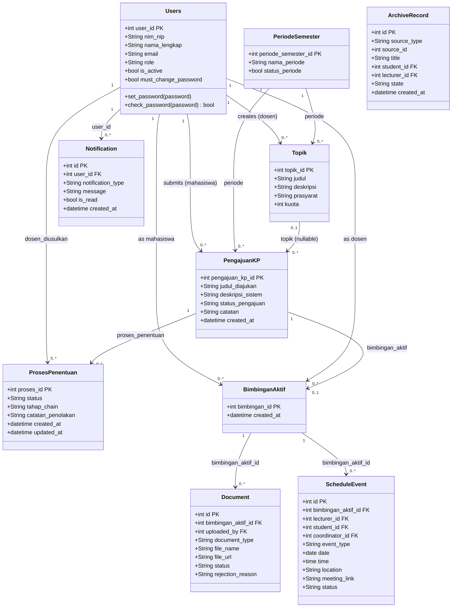

---

## 2. Design Patterns Class Diagram

### 2a. Factory Pattern — Pengajuan Creation

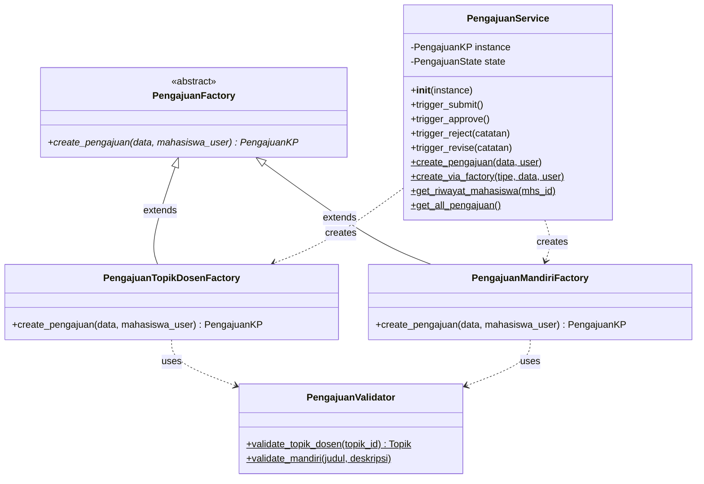

### 2b. State Pattern — PengajuanKP Status

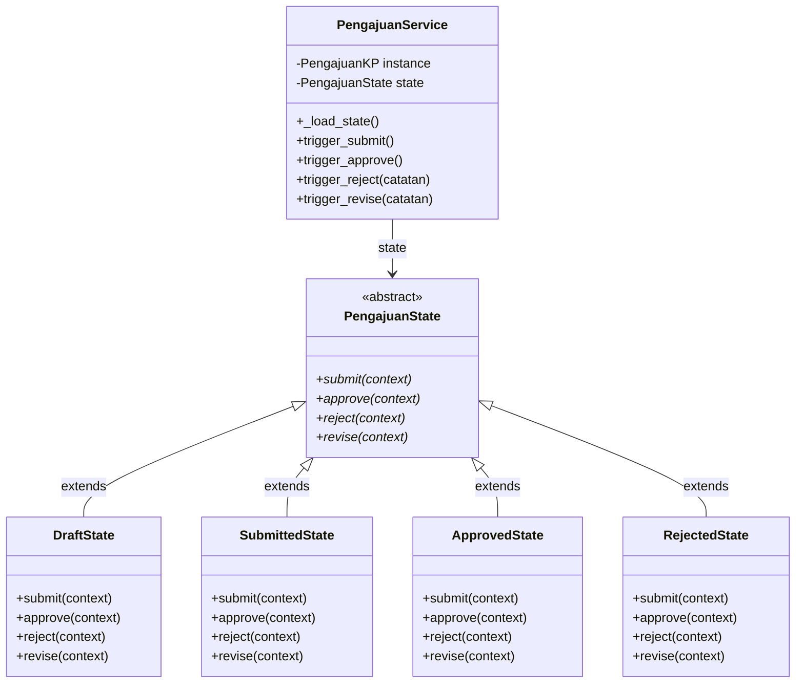

### 2c. State Pattern — ProsesPenentuan Approval

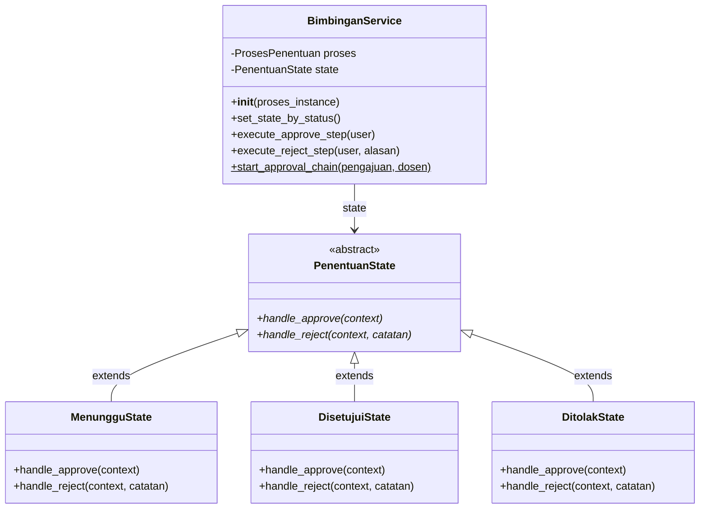

### 2d. Chain of Responsibility — Approval Chain

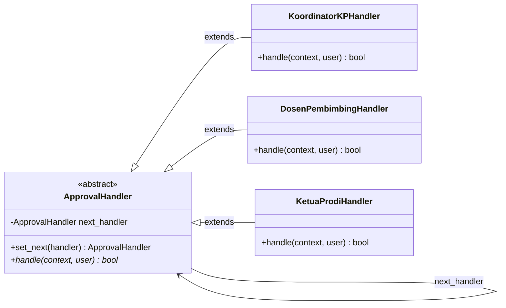

### 2e. Singleton Pattern — AuthSession

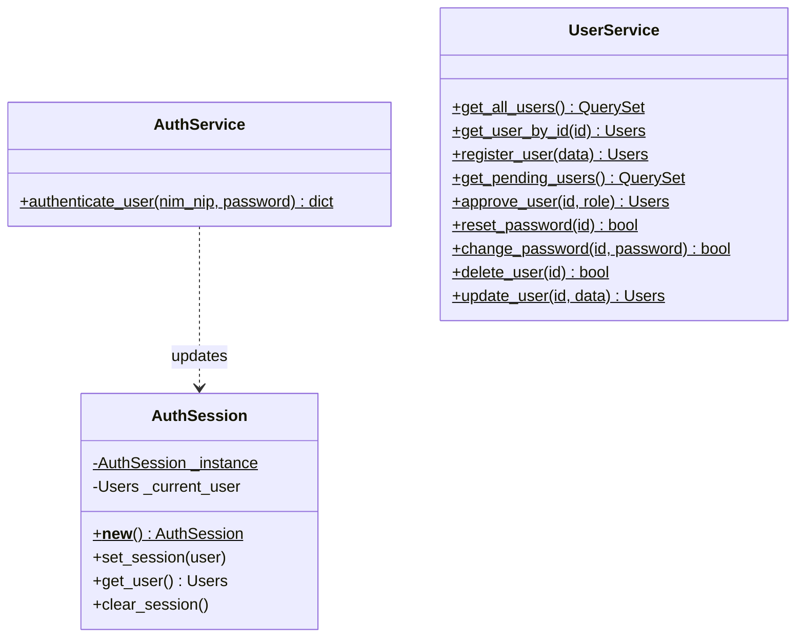

---

## 3. System Flow

### 3a. User Registration & Approval

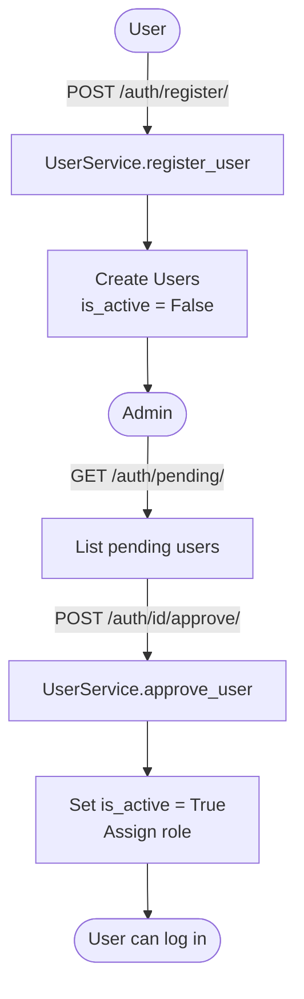

### 3b. Login Flow

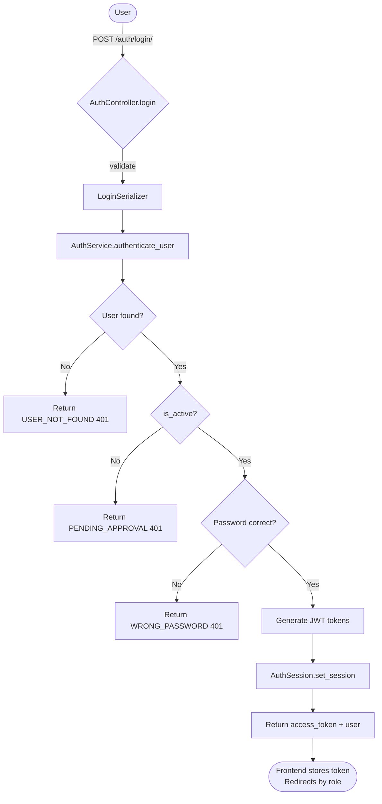

### 3c. Mahasiswa Submits Dosen's Topic

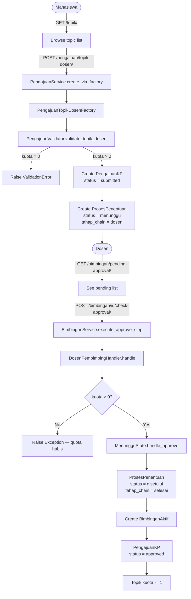

### 3d. Mahasiswa Submits Mandiri Topic → Koordinator Assigns Dosen

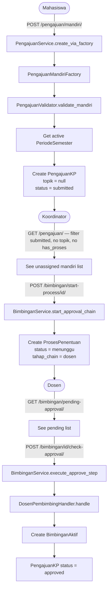

### 3e. Active Bimbingan — Document & Schedule

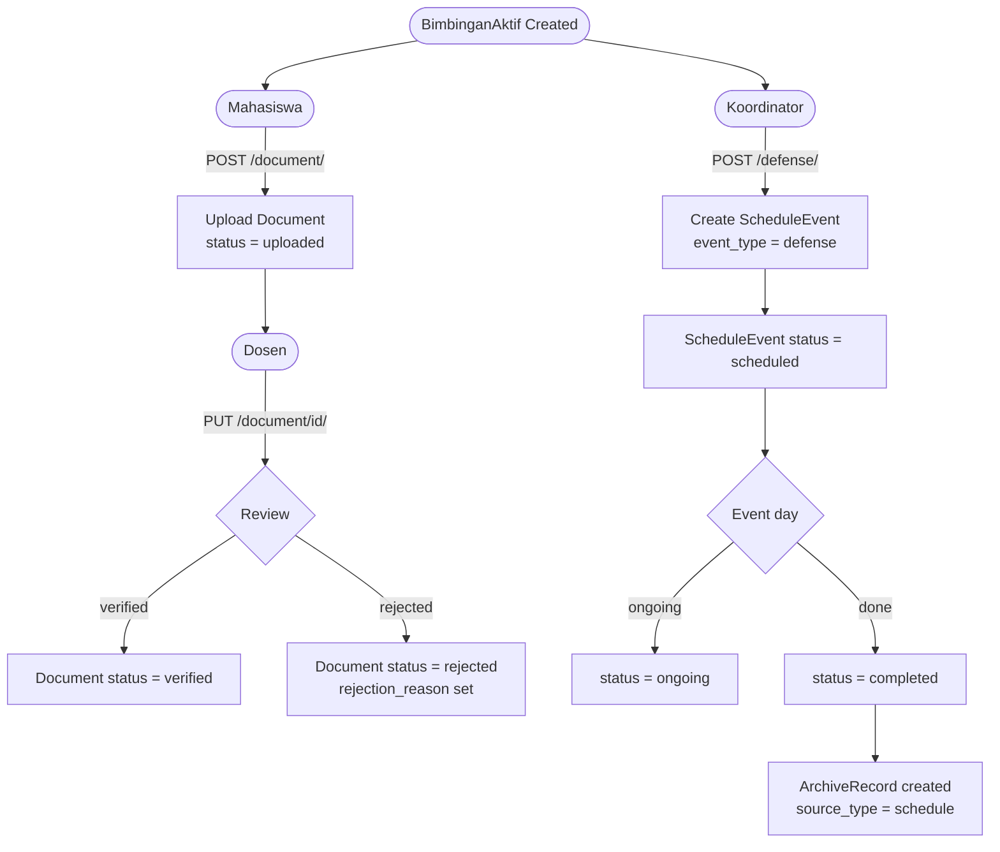

---

## 4. Summary — Class Relationships

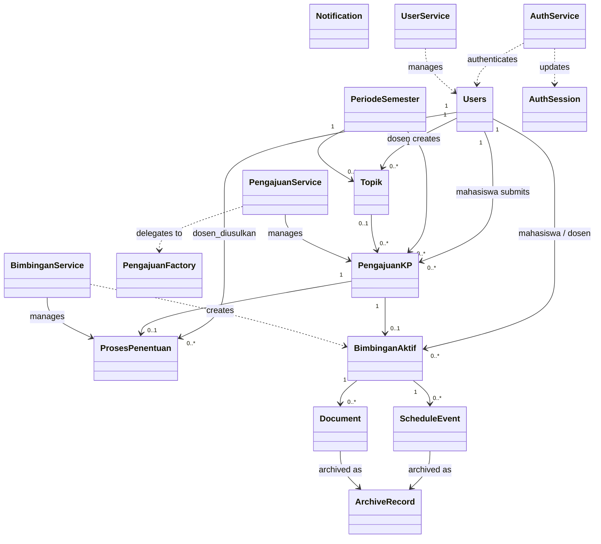
